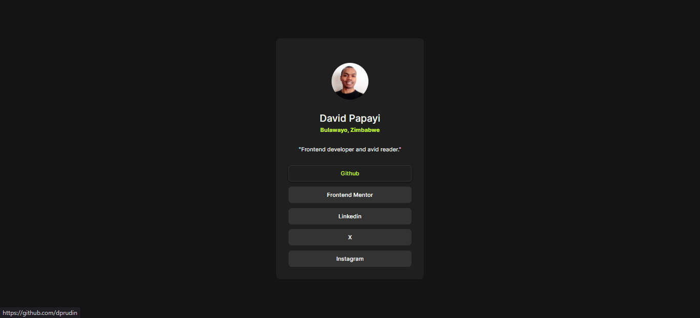

# Frontend Mentor - Social links profile solution

This is a solution to the [Social links profile challenge on Frontend Mentor](https://www.frontendmentor.io/challenges/social-links-profile-UG32l9m6dQ). Frontend Mentor challenges help you improve your coding skills by building realistic projects. 

## Table of contents

- [Overview](#overview)
  - [Screenshot](#screenshot)
  - [Links](#links)
- [My process](#my-process)
  - [Built with](#built-with)
  - [What I learned](#what-i-learned)
  - [Continued development](#continued-development)
  - [Useful resources](#useful-resources)
- [Author](#author)
- [Acknowledgments](#acknowledgments)

## Overview

In this HTML CSS challenge, I recreate the design in the screenshot and make it responsive across multiple screens.

### Screenshot



### Links

- Solution URL: [Github](https://github.com/dprudin/qr-code-component-main.git)

## My process

### Built with

- Flexbox
- Media Queries
- Relative units

### What I learned

Practiced using psuedo selectors for styling buttons.

```css
.btn:hover, .btn-primary:active {
    color: var(--green);
    background-color: var(--grey-800);
    border: 2px solid var(--grey-700);
    box-shadow: 0px 3px 6px var(--grey-900);
    cursor: pointer;
}
```

### Continued development

I want to further sharpen my skills on flex and grid layouts, as well as, CSS styling. Then move onto frameworks like Bootstrap and Tailwind.

### Useful resources

- [CSS Full Course](https://youtu.be/-G-zic_LS0A) - This helped me learn the fundamentals of CSS. I gained a deep understanding of the three pillars of responsive design - relative units, fluid layouts, and media queries.

## Author

- Linkedin - [David Papayi](www.linkedin.com/in/david-papayi)
- Frontend Mentor - [@dprudin](https://www.frontendmentor.io/profile/dprudin)
- Twitter / X - [@davidpapayi](https://x.com/DavidPapayi)

## Acknowledgments

I would like to thank Dan (https://futurefullstack.com) for his amazing free course on YouTube. It was such a comprehensive and detailed teaching on CSS responsive design.